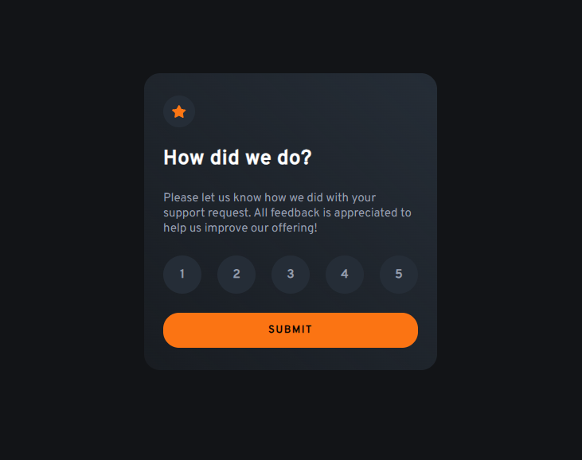

# Frontend Mentor - Interactive rating component solution

This is a solution to the [Interactive rating component challenge on Frontend Mentor](https://www.frontendmentor.io/challenges/interactive-rating-component-koxpeBUmI). Frontend Mentor challenges help you improve your coding skills by building realistic projects.

## Table of contents

- [Frontend Mentor - Interactive rating component solution](#frontend-mentor---interactive-rating-component-solution)
  - [Overview](#overview)
    - [The challenge](#the-challenge)
    - [Screenshot](#screenshot)
    - [Links](#links)
  - [My process](#my-process)
    - [Built with](#built-with)
    - [What I learned](#what-i-learned)
    - [Continued development](#continued-development)
    - [Useful resources](#useful-resources)
  - [Author](#author)
  - [Acknowledgments](#acknowledgments)

## Overview

### The challenge

Users should be able to:

- View the optimal layout for the app depending on their device's screen size
- See hover states for all interactive elements on the page
- Select and submit a number rating
- See the "Thank you" card state after submitting a rating

### Screenshot



### Links

- [Solution URL](https://your-solution-url.com)
- [Live Site URL](https://your-live-site-url.com)

## My process

### Built with

- Semantic HTML5 markup
- Mobile-first workflow
- CSS custom properties
- Flexbox
- CSS Grid
- [React](https://react.dev/) - JS library
- [Google fonts](https://fonts.google.com/) - Font library

### What I learned

- How to use the `useState` hook in React to manage different states of the component and do conditional rendering based on them. Also to manage errors and display them to the user and save information and share it between components.

- Use of the `&&` operator to do conditional rendering in React and its difference with the ternary operator.

```jsx
{
  error && <p className='error-message'>{error}</p>
}
```

- Use of the callbacks in the `useState` hook to update the state of the component and do some actions after the state has been updated.

- The `&apos;` character to escape the single quote character in the JSX code.

```html
<p className="thank-you-card__paragraph">
  We appreciate you taking the time to give a rating. If you ever need more
  support, don&apos;t hesitate to get in touch!
</p>
```

### Continued development

- I want to continue learning about React and its hooks to improve my skills and be able to build more complex applications.

- I want to practice more with the `useState` hook to understand better how to manage the state of the components and share information between them and do conditional rendering based on the state of the component.

### Useful resources

- [Uiverse](https://uiverse.io/) - This is an amazing community-built library of UI elements. It helped me design the rating card and the thank you card. I really liked this platform and will use it going forward.
- [gitignore.io](https://www.toptal.com/developers/gitignore) - This helped me to create the `.gitignore` file for the project. This tool is very useful because it generates the `.gitignore` file based on the technologies you are using in your project.

## Author

- Frontend Mentor - [@jdrodriguez2707](https://www.frontendmentor.io/profile/jdrodriguez2707)
- X - [@Johan79854000](https://twitter.com/Johan79854000)
- LinkedIn - [Johan Rodriguez](https://www.linkedin.com/in/jdrodriguez2707/)
- Instagram - [@johan_rodriguez_dev](https://www.instagram.com/johan_rodriguez_dev)

## Acknowledgments

I want to thank Frontend Mentor for providing me with this challenge. It helped me to improve my skills in React and web design. I also want to thank the content creator [Midudev](https://cursoreact.dev/) for his React course. It helped me to understand better the basic concepts of React. Finally, I would advise developers don't be afraid to ask AI for help when you are stuck. It's a great way to learn new things and improve your skills fastly. The most important thing is to understand the code and know how to apply it in your projects.

